# 恐怖黎明图腾
## 左侧大地图

### 第一个刷点（被遗忘的虚空之触图腾）
  
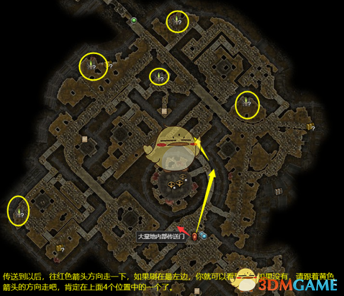

### 第二个刷点（被遗忘的虚空之触图腾）
大墓地洞口，一直深入就是。

### 第三个刷点
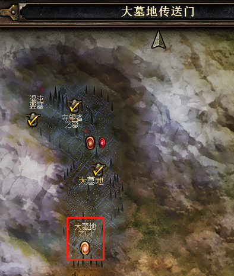
#### 情况一
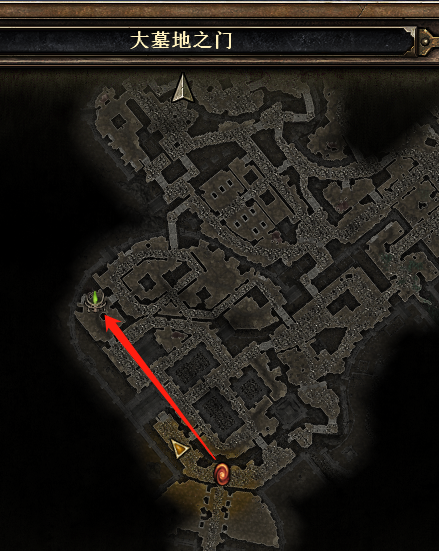
#### 情况二
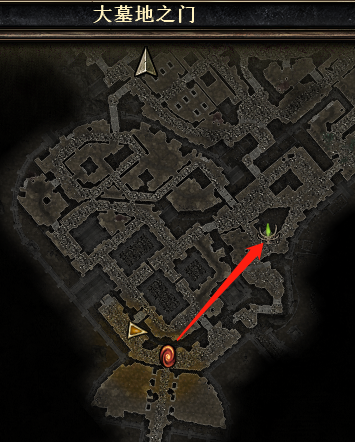
#### 情况三（被遗忘的虚空之触图腾）
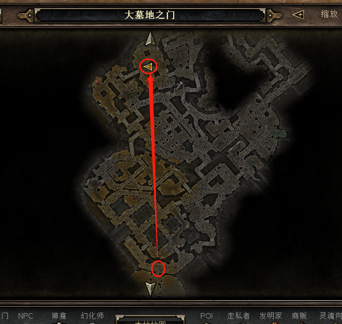

### 第四个刷点（被遗忘的狂怒图腾）
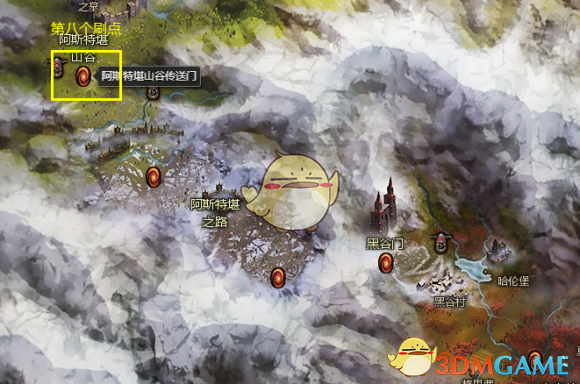  

### 第五个刷点（被遗忘的狂怒图腾）
  

### 第六个刷点（被遗忘的虚空之触图腾）
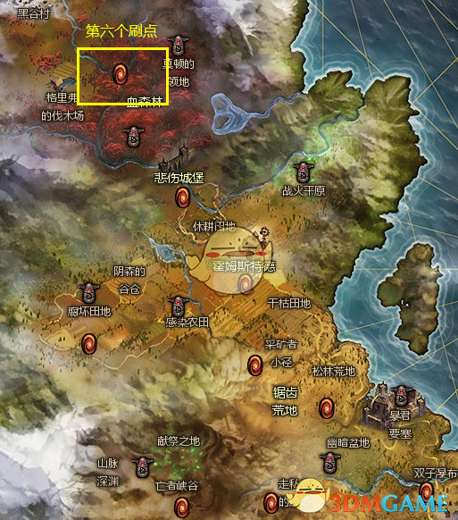  
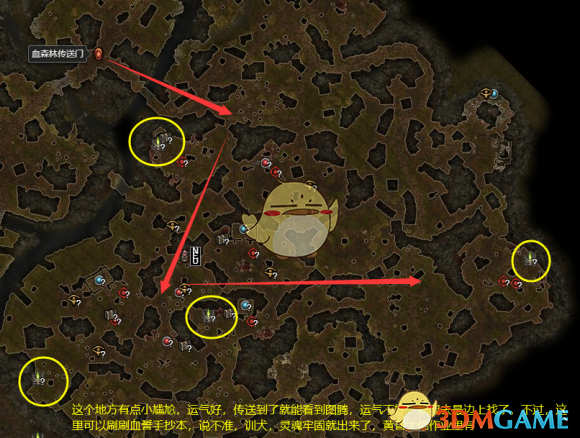

### 第七个刷点
克隆利的藏身处，要么在门口，要么在克隆利旁边，要是在克隆利旁边，可以顺便把守财奴马丁、看门口的、克隆利三个打了。  
#### 门口的是 灵魂图腾  
#### 克隆利旁边的是 虚化扭曲图腾

### 第八个刷点（被遗忘的灵魂图腾）
  

### 第九个刷点（被遗忘的灵魂图腾）
  
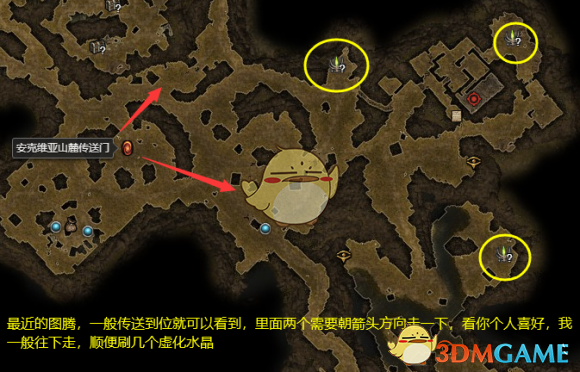

### 第十个刷点
  

### 第十一个刷点（这个图不一定有图腾，冥煞魔印永远的痛）
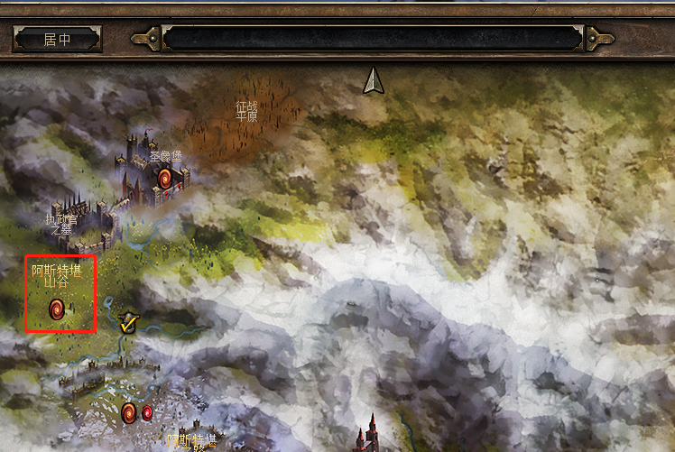  
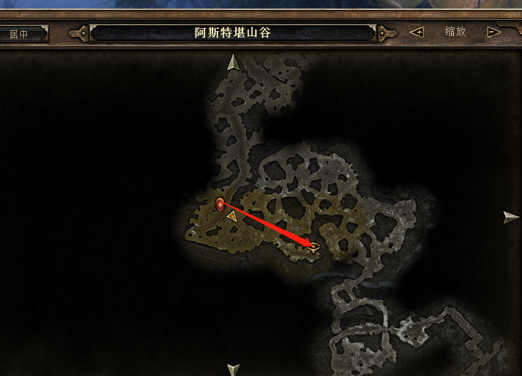
#### 情况一
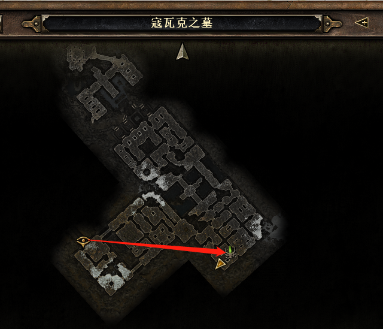