# 恐怖黎明图腾
## 第一幕

### 第一个刷点
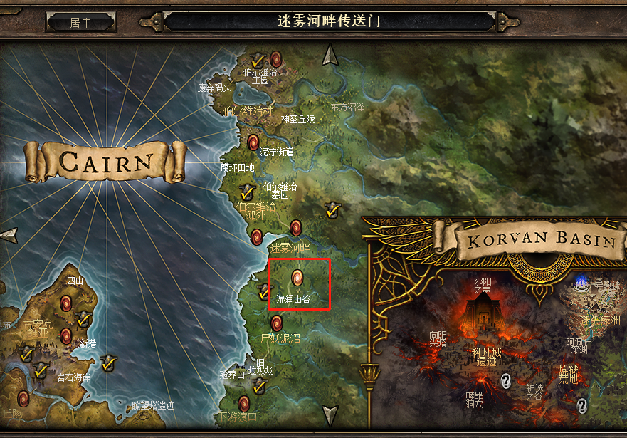
#### 情况 1（狂怒图腾）
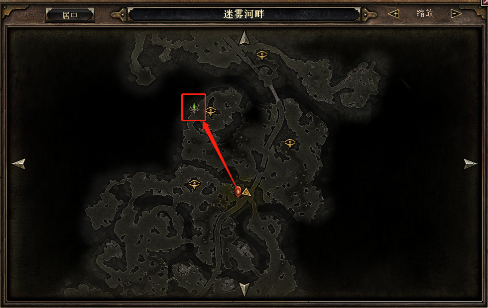
#### 情况 2（待定）

#### 情况 2-1（待定）
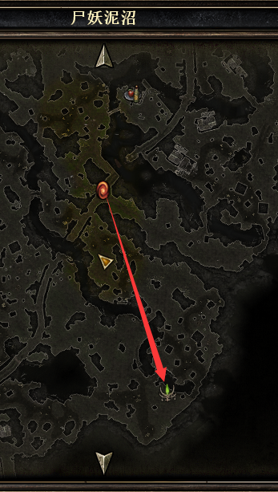
#### 情况 2-2（狂怒图腾）

### 第二个刷点
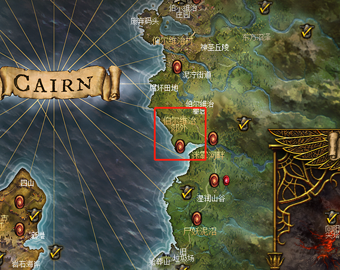
#### 情况一（虚化扭曲图腾）
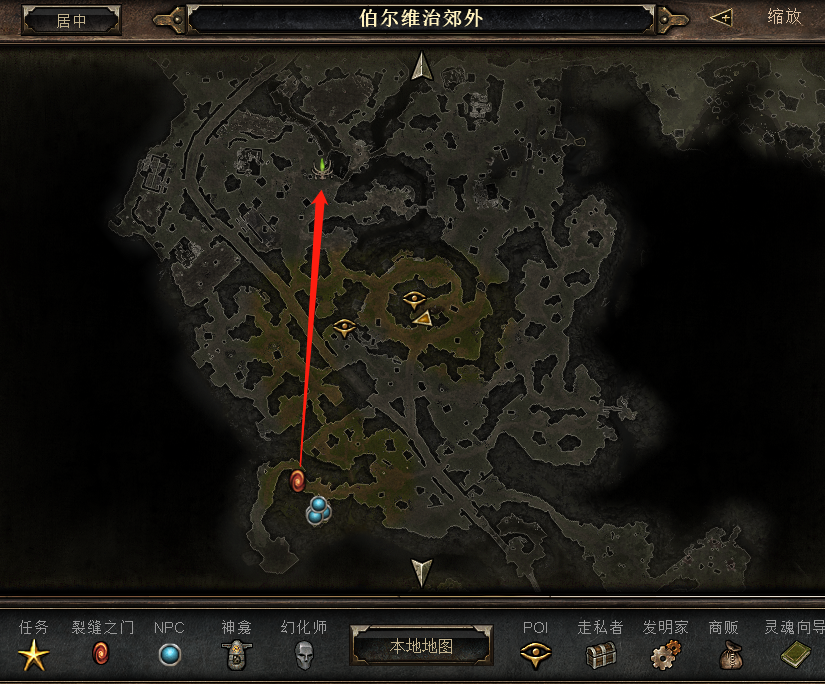
#### 情况二（狂怒图腾）
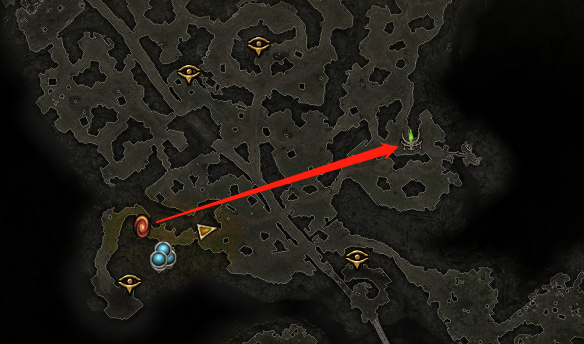
#### 情况三（虚化扭曲图腾）
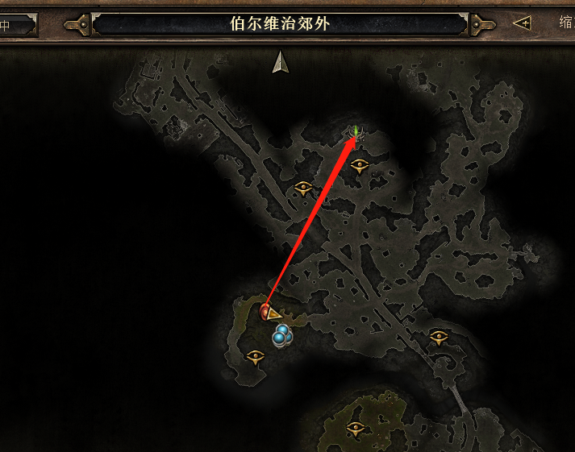

### 第三个刷点
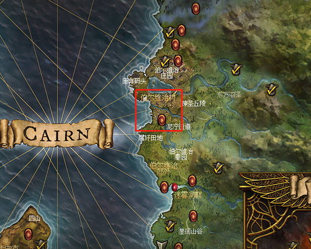  
#### 情况一（被遗忘的虚化扭曲图腾）
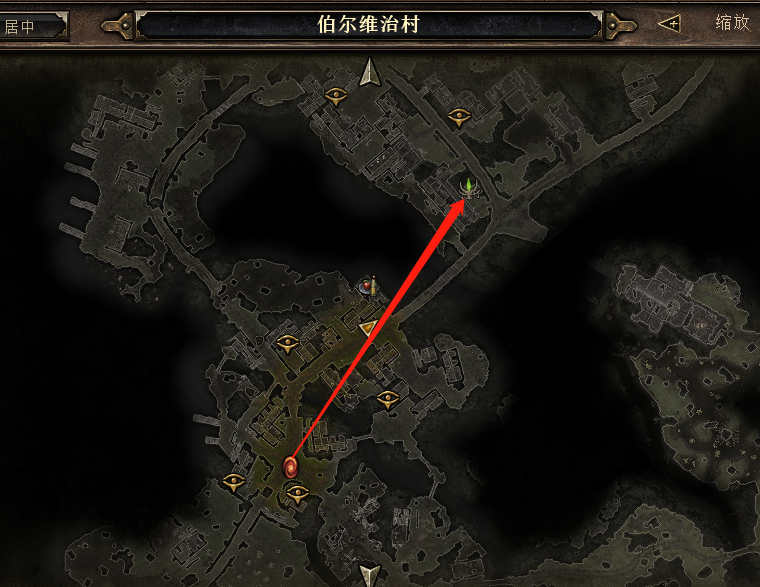  
#### 情况二（被遗忘的虚化扭曲图腾）
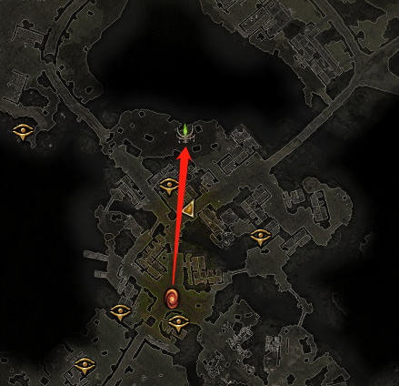
#### 情况三（被遗忘的虚化扭曲图腾）
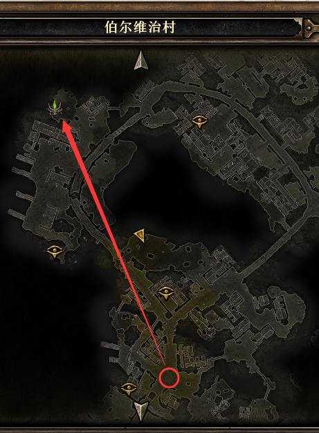

### 第四个刷点（远古的虚化扭曲图腾）
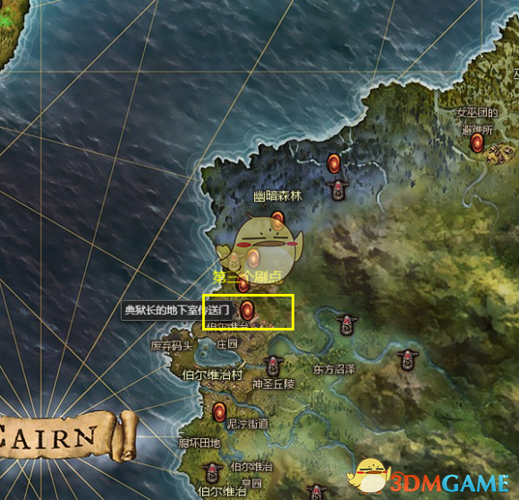  
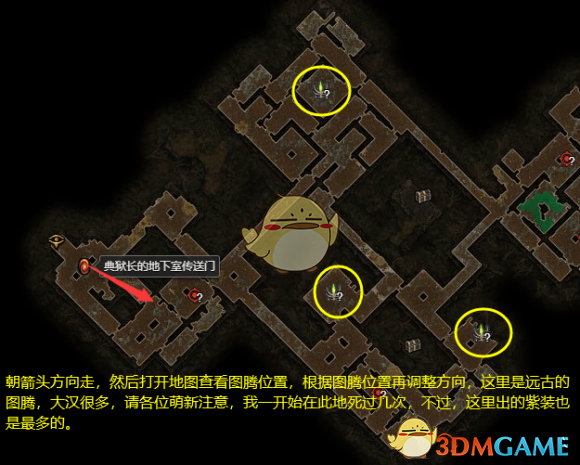  

### 第五个刷点
优先情况一，没人会觉得水晶少的，去到情况一的点，如果没有，那里能够瞄到情况三的点，如果是情况三，路太绕，基本可以不去，打完水晶就跑

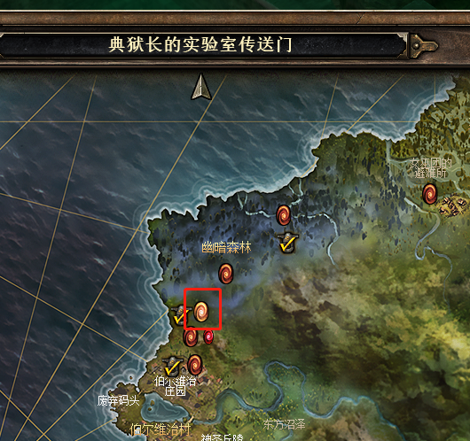
#### 情况一（被遗忘的虚化扭曲图腾）
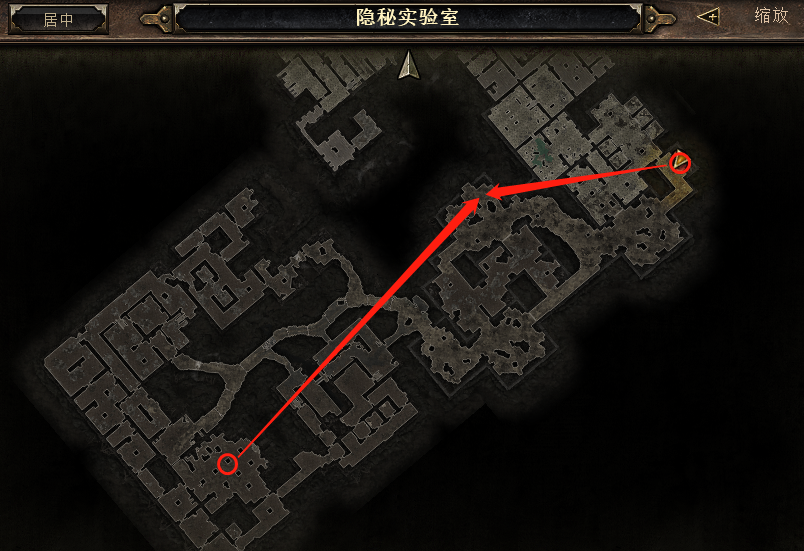
#### 情况二
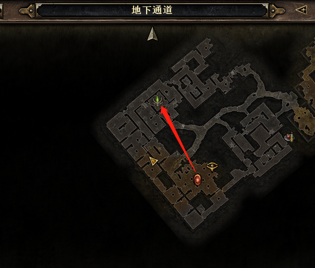
#### 情况三（被遗忘的虚化扭曲图腾）
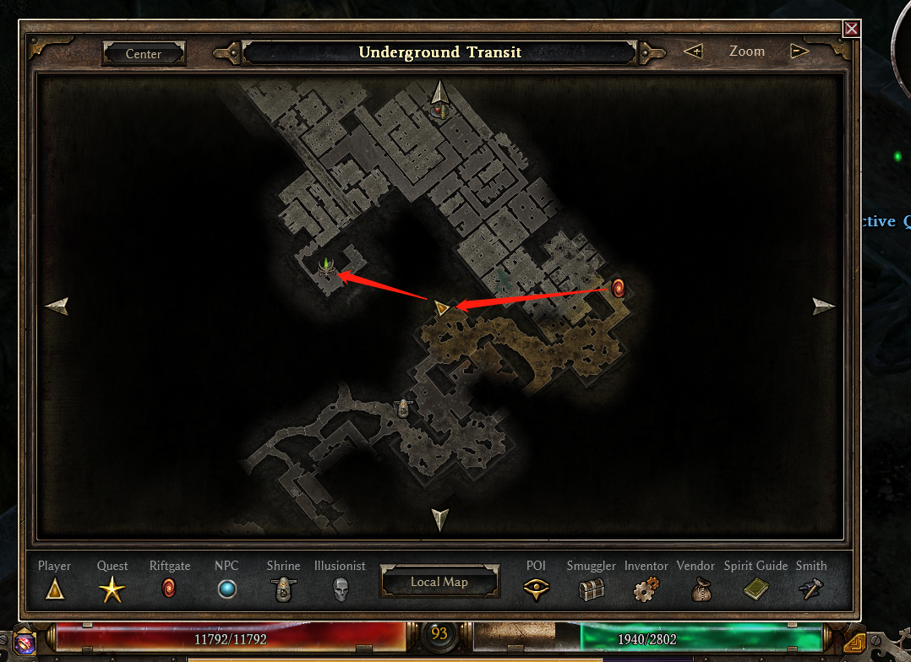