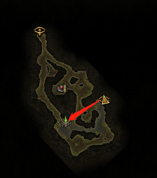
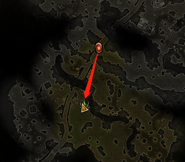

# 恐怖黎明图腾
## 第一幕

### 迷雾河畔
#### Action 1-传送门
1. 中-迷雾河畔传送门
1. en-Foggy Bank Rift
1. ID-<https://www.grimtools.com/map/markers/rifts/1234>
---

#### Action 1-1
1. 中-狂怒图腾
1. en-Savage Totem
1. ID-<https://www.grimtools.com/map/markers/totems/12941>
1. groups-<https://www.grimtools.com/map/groups/463>
---

#### Action 1-2-入口
1. ID-<https://www.grimtools.com/map/markers/poi/236>
---

#### Action 1-2-1
1. 中-狂怒图腾
1. ID-<https://www.grimtools.com/map/markers/totems/12822>
1. groups-<https://www.grimtools.com/map/groups/463>
---

### 尸妖泥沼
#### Action 1-传送门
1. en-Wightmire Rift
1. 中-尸妖泥沼传送门
1. ID-<https://www.grimtools.com/map/markers/rifts/492>
---

#### Action 1-1
1. en-Savage Totem
1. 中-狂怒图腾
1. ID-<https://www.grimtools.com/map/markers/totems/12714>
1. groups-<https://www.grimtools.com/map/groups/460~1>
---

#### Action 1-2
1. 中-狂怒图腾
1. ID-<https://www.grimtools.com/map/markers/totems/12709>
1. groups-<https://www.grimtools.com/map/groups/460~1>
---

#### Action 1-3
1. 中-狂怒图腾
1. ID-<https://www.grimtools.com/map/markers/totems/12711>
1. groups-<https://www.grimtools.com/map/groups/460~1>
#### Action 1-4
1. 中-狂怒图腾
1. ID-<https://www.grimtools.com/map/markers/totems/12708>
1. groups-<https://www.grimtools.com/map/groups/460~1>
---

#### Action 1-5
1. 中-虚化扭曲图腾
1. ID-<https://www.grimtools.com/map/markers/totems/12685>
1. groups-<https://www.grimtools.com/map/groups/460~2>

### 伯尔维治郊外
#### Action 1-传送门
1. en-Burrwitch Outskirts Rift
1. 中-伯尔维治郊外传送门
1. ID-<https://www.grimtools.com/map/markers/rifts/599>
---

#### Action 1-1
1. 中-虚化扭曲图腾
1. en-Aetherwarped Totem
1. groups-<https://www.grimtools.com/map/groups/469~2>
---

#### Action 1-2
1. 中-虚化扭曲图腾
1. en-Aetherwarped Totem
1. groups-<https://www.grimtools.com/map/groups/469~2>
1. ID-<https://www.grimtools.com/map/markers/totems/12687>
---

#### Action 1-3
1. en-Savage Totem
1. 中-狂怒图腾
1. groups-<https://www.grimtools.com/map/groups/469~1>
---

### 伯尔维治村
#### Action 1-传送门
1. 中-伯尔维治村传送门
1. en-Burrwitch Village Rift
1. ID-<https://www.grimtools.com/map/markers/rifts/612>
---

#### Action 1-1
1. 中-被遗忘的虚化扭曲图腾
1. ID-<https://www.grimtools.com/map/markers/totems/12721>
1. groups-<https://www.grimtools.com/map/groups/462>
---

#### Action 1-2
1. 中-被遗忘的虚化扭曲图腾
1. ID-<https://www.grimtools.com/map/markers/totems/12724>
1. groups-<https://www.grimtools.com/map/groups/462>
---

#### Action 1-3
1. 中-被遗忘的虚化扭曲图腾
1. ID-<https://www.grimtools.com/map/markers/totems/12718>
1. groups-<https://www.grimtools.com/map/groups/462>
---

### 典狱长的地下室
#### Action 1-传送门
1. 中-典狱长的地下室传送门
1. en-Warden's Cellar Rift
1. ID-<https://www.grimtools.com/map/markers/rifts/1399>
---

#### Action 1-1
1. 中-远古的虚化扭曲图腾
1. en-Ancient Aetherwarped Totem
1. groups-<https://www.grimtools.com/map/groups/446>
---
  

### 典狱长的实验室
优先情况一，没人会觉得水晶少的，去到情况一的点，如果没有，那里能够瞄到情况三的点，如果是情况三，路太绕，基本可以不去，打完水晶就跑

#### Action 1-传送门
1. 中-典狱长的实验室传送门
1. en-Warden's Laboratory Rift
1. ID-<https://www.grimtools.com/map/markers/rifts/2019>
---

#### Action 1-1
1. 中-被遗忘的虚化扭曲图腾
1. en-Forsaken Aetherwarped Totem
1. groups-<https://www.grimtools.com/map/groups/453>
---

#### Action 1-2
1. 中-被遗忘的虚化扭曲图腾
1. en-Forsaken Aetherwarped Totem
1. groups-<https://www.grimtools.com/map/groups/453>
1. ID-<https://www.grimtools.com/map/markers/totems/12888>
---

#### Action 1-3
1. 中-被遗忘的虚化扭曲图腾
1. en-Forsaken Aetherwarped Totem
1. groups-<https://www.grimtools.com/map/groups/453>
---
