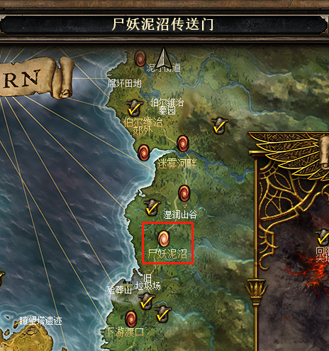
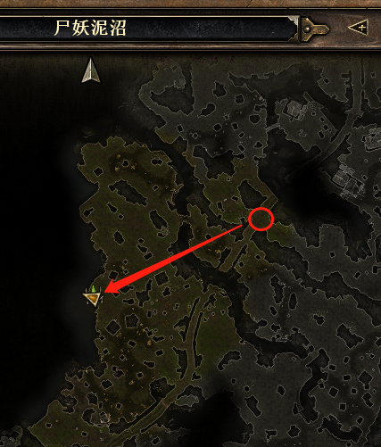

# 恐怖黎明图腾
## 第一幕

### 第一个刷点
#### Action 1-传送门
1. en-Foggy Bank Rift
1. ID-<https://www.grimtools.com/map/markers/rifts/1234>
---

#### Action 1-1
1. 中-狂怒图腾
1. en-Savage Totem
1. groups-<https://www.grimtools.com/map/groups/463>
1. ID-<https://www.grimtools.com/map/markers/totems/12941>
---

### 第二个刷点
#### Action 1-传送门
1. en-Wightmire Rift
1. 中-尸妖泥沼传送门
1. ID-<https://www.grimtools.com/map/markers/rifts/492>
---

#### Action 1-1
1. en-Savage Totem
1. ID-<https://www.grimtools.com/map/markers/totems/12714>
1. groups-<https://www.grimtools.com/map/groups/460~2>
---

#### Action 1-2
1. 中-狂怒图腾
1. ID-<https://www.grimtools.com/map/markers/totems/12709>
1. groups-<https://www.grimtools.com/map/groups/460~2>
---

### 第三个刷点
#### Action 1-传送门
1. en-Burrwitch Outskirts Rift
1. ID-<https://www.grimtools.com/map/zh/markers/rifts/599>
---

#### Action 1-1
1. 中-虚化扭曲图腾
1. en-Aetherwarped Totem
1. groups-<https://www.grimtools.com/map/groups/469~2>
---

#### Action 1-2
1. 中-虚化扭曲图腾
1. en-Aetherwarped Totem
1. groups-<https://www.grimtools.com/map/groups/469~2>
1. ID-<https://www.grimtools.com/map/markers/totems/12687>
---

#### Action 1-3
1. en-Savage Totem
1. 中-狂怒图腾
1. groups-<https://www.grimtools.com/map/groups/469~1>
---

### 第四个刷点
#### Action 1-传送门
1. en-Burrwitch Village Rift
1. ID-<https://www.grimtools.com/map/markers/rifts/612>
---

#### Action 1-1
1. 中-被遗忘的虚化扭曲图腾
1. groups-<https://www.grimtools.com/map/groups/462>
---

#### Action 1-2
1. 中-被遗忘的虚化扭曲图腾
1. groups-<https://www.grimtools.com/map/groups/462>
1. ID-<https://www.grimtools.com/map/markers/totems/12724>
---

#### Action 1-3
1. 中-被遗忘的虚化扭曲图腾
1. groups-<https://www.grimtools.com/map/groups/462>
---

### 第五个刷点
#### Action 1-传送门
1. en-Warden's Cellar Rift
1. ID-<https://www.grimtools.com/map/markers/rifts/1399>
---

#### Action 1-1
1. 中-远古的虚化扭曲图腾
1. en-Ancient Aetherwarped Totem
1. groups-<https://www.grimtools.com/map/groups/446>
---
  

### 第六个刷点
优先情况一，没人会觉得水晶少的，去到情况一的点，如果没有，那里能够瞄到情况三的点，如果是情况三，路太绕，基本可以不去，打完水晶就跑

#### Action 1-传送门
1. en-Warden's Laboratory Rift
1. ID-<https://www.grimtools.com/map/markers/rifts/2019>
---

#### Action 1-1
1. 中-被遗忘的虚化扭曲图腾
1. en-Forsaken Aetherwarped Totem
1. groups-<https://www.grimtools.com/map/groups/453>
---

#### Action 1-2
1. 中-被遗忘的虚化扭曲图腾
1. en-Forsaken Aetherwarped Totem
1. groups-<https://www.grimtools.com/map/groups/453>
---

#### Action 1-3
1. 中-被遗忘的虚化扭曲图腾
1. en-Forsaken Aetherwarped Totem
1. groups-<https://www.grimtools.com/map/groups/453>
---
